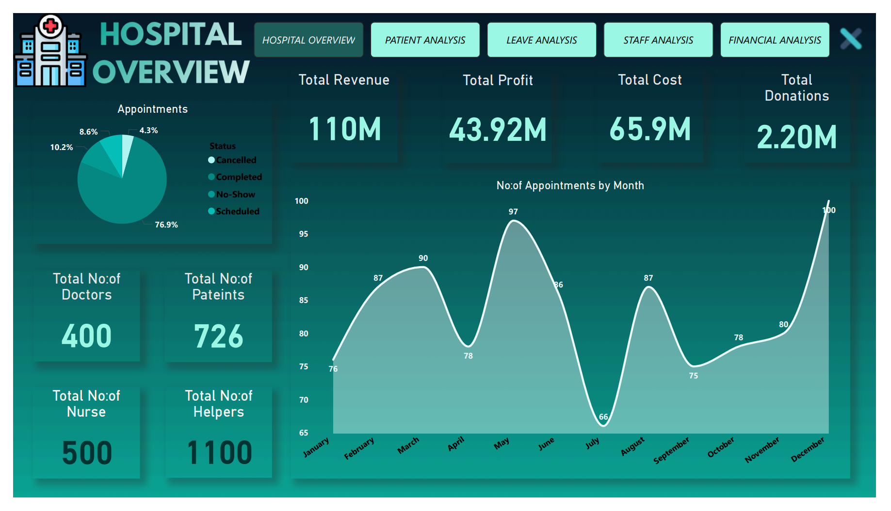
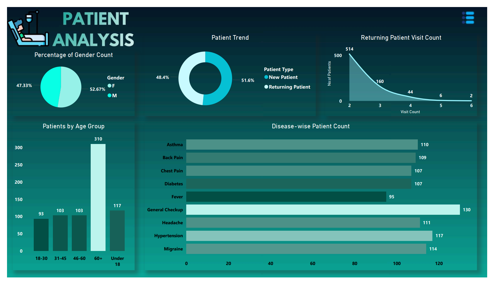
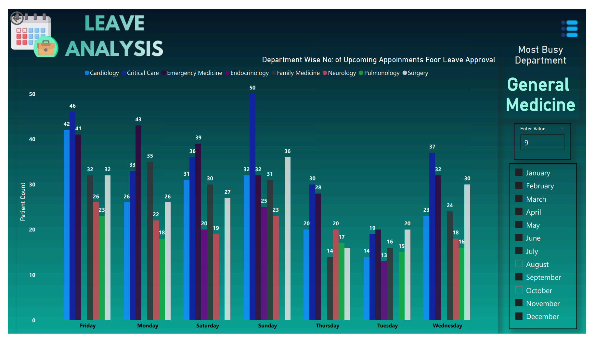
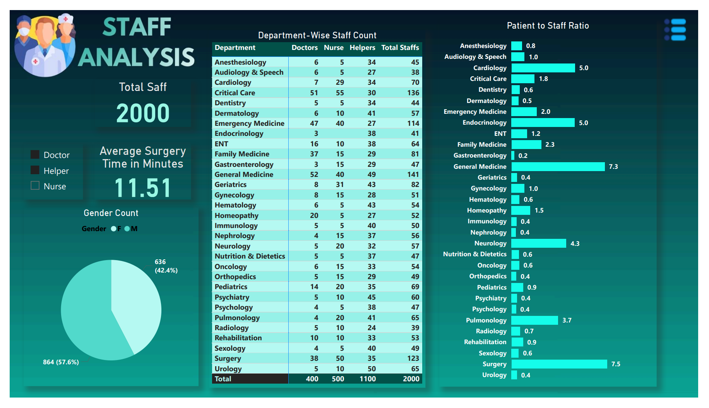
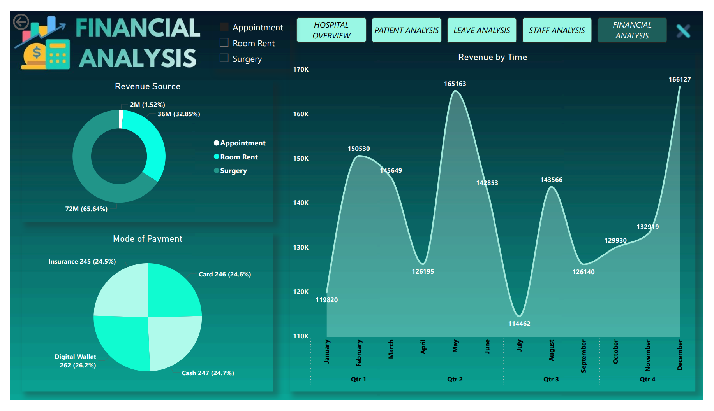

# 🏥 Hospital Analytics Report (Power BI)

## 📊 Project Overview
This project presents a comprehensive **Hospital Analytics Dashboard** built using Power BI to analyze patient trends, staff efficiency, and financial performance.  
The dashboard enables data-driven decision-making for hospital operations and resource management.

---

## 🎯 Objective
- Analyze patient behavior and demand patterns  
- Evaluate staff workload and utilization  
- Monitor financial performance and revenue sources  
- Support operational decisions like leave planning and resource allocation  

---

## 🗂 Dataset Overview
- Multi-table relational dataset (~14 tables)  
- Includes:
  - Patients & Appointments  
  - Staff (Doctors, Nurses, Helpers)  
  - Departments  
  - Financial records (Room, Surgery, Payments)  

---

## 🛠 Tools & Technologies
- **Power BI** (DAX, Power Query)  
- **SQL** (data extraction)  
- **Python** (Pandas, NumPy for preprocessing)  
- **Excel** (data preparation)  

---

## 🔧 Data Processing
- Handled missing values and duplicates  
- Standardized formats (dates, gender)  
- Created calculated columns (Age, Age Groups)  
- Built relationships between multiple tables  
- Implemented efficient data model  

---

## 🧮 Key DAX Measures
- Total Revenue, Total Profit  
- Patient-to-Staff Ratio  
- Workload Index  
- Top Department (RANKX, TOPN)  
- Dynamic Metric Selection (SWITCH + Disconnected Table)  

---

## 📊 Dashboard Pages

---

### 🔹 1. Hospital Overview

- KPIs: Revenue, Profit, Patients, Staff  
- Appointment trends  
- Appointment status distribution  

---

### 🔹 2. Patient Analysis

- Age group distribution  
- Disease-wise patient count  
- New vs Returning patients  
- Patient trends  

---

### 🔹 3. Leave Analysis

- Department-wise workload by day  
- Leave planning insights  
- Most busy department identification  

---

### 🔹 4. Staff Analysis

- Gender distribution  
- Staff count by department  
- Patient-to-staff ratio (workload analysis)  

---

### 🔹 5. Financial Analysis

- Revenue breakdown (Appointment, Room, Surgery)  
- Revenue trends over time  
- Payment mode analysis  
- Dynamic metric selection using slicer  

---

## 🎛 Key Features
- Interactive slicers and filters  
- Drill-through functionality  
- Dynamic measure selection  
- Conditional formatting  
- Multi-page navigation  

---

## 📈 Key Insights
- Identified high workload departments using patient-to-staff ratio  
- Analyzed patient demand patterns across diseases and age groups  
- Enabled better leave planning based on department demand  
- Highlighted major revenue sources and financial trends  

---

## 🧠 Business Impact
- Supports workforce optimization  
- Improves operational efficiency  
- Enables data-driven decision-making  
- Helps identify revenue opportunities  

---

## 🏁 Conclusion
This project demonstrates end-to-end data analytics using Power BI, including data modeling, DAX calculations, and interactive dashboard design to solve real-world healthcare problems.

---

## 📬 Contact
- Name: Joshua Johny  
- Email: joshuajohnyjj@gmail.com  
